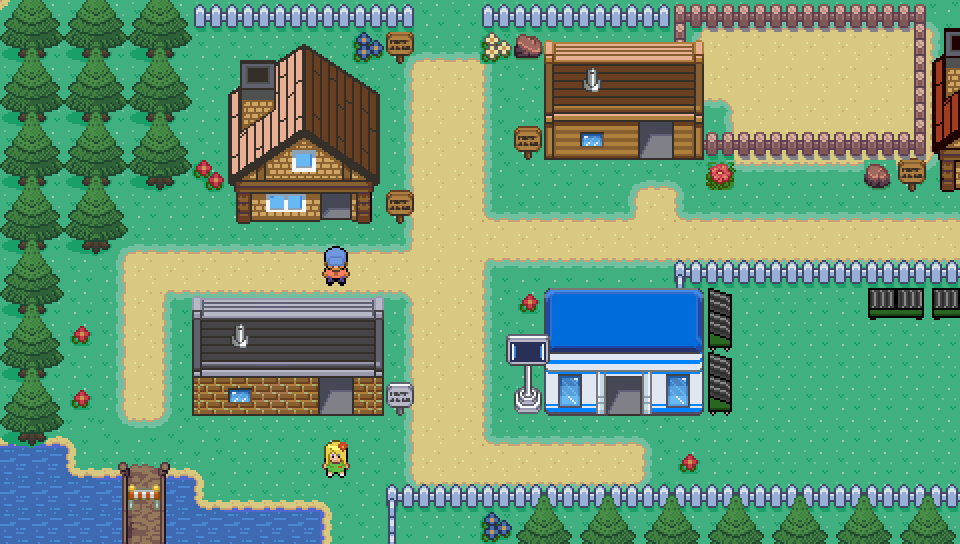
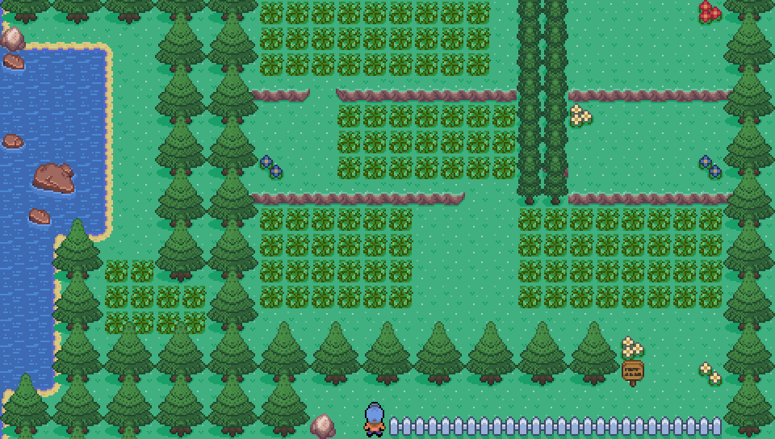
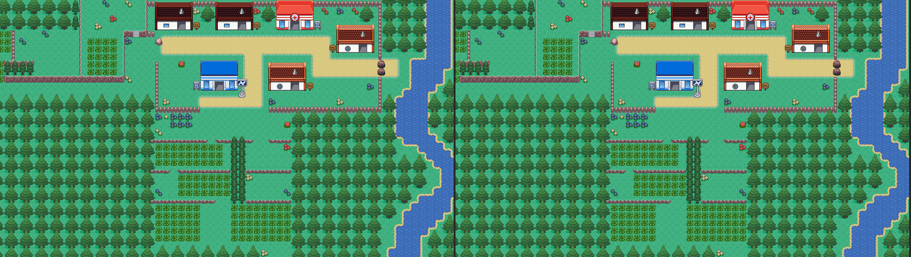
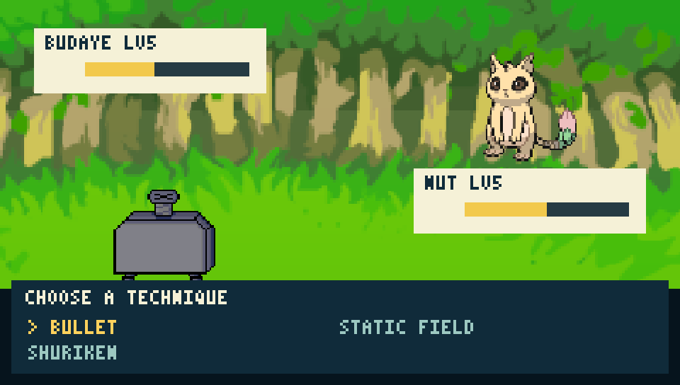

# Pocket Tuxemon

[Tuxemon](https://github.com/Tuxemon/Tuxemon)'s world — its maps, events,
characters and dialogue — imported into
[Pocket RPG Kit](https://github.com/lfkdsk/pocket-rpgkit) and played on
[PocketJS](https://github.com/pocket-nexus/pocketjs) (desktop, web, PSP).

Work in progress. The importer reads a pinned Tuxemon checkout
(`bun run fetch:tuxemon`, commit `9e6258ff`) and writes
`rpgkit-project/v1` documents and baked art into this repository.

<p align="center">
  
  
</p>

## Status

- **World (P1, playable):** all 263 Tuxemon maps and their 4,572 events are
  imported automatically — terrain with one-way ledges, animated tiles, tall
  NPC walkers, dialogue, cutscene routes and map transfers. The Spyder
  campaign plays from the bedroom through Paper Town to Route 1, and every
  imported input lock is executed to its unlock.
- **Battles (P2, in progress):** the battle database and 511 battle
  textures are imported from Tuxemon's YAML, and `battle/` is a pure
  reducer whose results match Tuxemon's own Python engine on 8,560 recorded
  battles; monsters spawn draw-for-draw like Tuxemon's. Trainer battles,
  wild and random encounters, parties and the faint point run in game, and
  the opening fight is played for real (win and lose lines). Double
  battles, capture, items and levelling are still to come.
- **Performance:** maps load one at a time from the pak — the game JS is
  1.1 MB and reaches its first frame in about 175 ms on the desktop QuickJS
  host; walking stays near 1 ms per frame and map transfers under 15 ms.

## Screenshots

The world renders pixel-for-pixel like Tuxemon's own maps. Left: this
runtime; right: an independent render of the same Tuxemon TMX map, used as
the reference in the terrain tests (0 differing pixels).



The first trainer battle, played for real: Billie's Budaye against Nut,
with sprites, HUD and backgrounds imported from Tuxemon and the rules
running bit-exact with Tuxemon's own engine. (The battle screen is still a
minimal one; Tuxemon's full skin and animations come next.)

<p align="center">
  
</p>

## Running

```sh
bun run setup           # submodules + dependencies
bun run fetch:tuxemon   # pinned Tuxemon checkout
bun run import          # Tuxemon -> project, maps, art and battle data
bun run desktop         # play on the desktop host
bun run web             # build the web version into dist/web
bun test                # tests (build first for the pixel replays)
```

## License

Tuxemon's code is GPL-3.0-or-later and its art CC BY-SA; this port and
everything it derives from Tuxemon are distributed under the same terms.
Pocket RPG Kit (vendored at `vendor/pocket-rpgkit`) is MIT.

The full GPL-3.0 text is in [`LICENSE`](LICENSE). Tuxemon's per-asset credits
and licenses (for the maps, sprites, tilesets, battle art and dialogue this
repository imports) are copied verbatim from Tuxemon `9e6258ff` into
[`licenses/TUXEMON-ATTRIBUTIONS.md`](licenses/TUXEMON-ATTRIBUTIONS.md), with its
contributor list in
[`licenses/TUXEMON-CONTRIBUTORS.md`](licenses/TUXEMON-CONTRIBUTORS.md).
