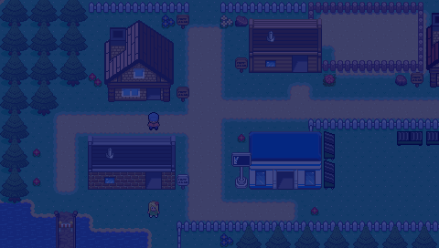

# Pocket Tuxemon

[Tuxemon](https://github.com/Tuxemon/Tuxemon)'s world — its maps, events,
characters and dialogue — imported into
[Pocket RPG Kit](https://github.com/lfkdsk/pocketjs-rpgkit) and played on
[PocketJS](https://github.com/pocket-nexus/pocketjs) (desktop, web, PSP).

Work in progress. The importer reads a pinned Tuxemon checkout
(`bun run fetch:tuxemon`, commit `9e6258ff`) and writes
`rpgkit-project/v1` documents and baked art into this repository.

<p align="center">
  
  
</p>

## Status

The per-system checklist is in [docs/status.md](docs/status.md); the
summary:

- **World (P1, playable):** all 263 Tuxemon maps and their 4,572 events are
  imported automatically — terrain with one-way ledges, animated tiles, tall
  NPC walkers, dialogue, cutscene routes and map transfers. The Spyder
  campaign plays from the bedroom through Paper Town, Cotton Town, City Park,
  the north end of Route 3, Route 4 and Flower City to the Captain's return
  in the Mansion and on through Candy Town to the hospital cure — 172,060
  frames at 60 Hz for the full mainline, driven by
  deterministic autoplay tapes — and every imported input lock is executed
  to its unlock.
- **Battles (P2, complete):** the battle database and 578 battle
  textures are imported from Tuxemon's YAML, and `battle/` is a pure
  reducer whose results match Tuxemon's own Python engine on 8,560 recorded
  battles; monsters spawn draw-for-draw like Tuxemon's. The mainline is
  played for real end to end: the autoplay tapes fight 173 real battles
  (100 on the Route 3 mainline — 22 trainer + 78 wild — 17 on the
  Captain-return continuation — 10 trainer + 7 wild — and 56 on the way to
  the hospital cure — 50 trainer + 6 wild), and every trainer
  battle enters Battle Processing and ends `won` with its `battle_outcome`
  written back. The frozen 30-minute 60 Hz tape (109,983 frames / 30 min 33 s)
  replays byte-identical at 60, 30 and 20 Hz, and both failure paths are
  verified — the first loss against Billie, and a later loss on Route 3
  with the faint-point teleport, the heal-before-leaving block and the
  nurse recovery. Double battles, capture, items, swapping and levelling
  are live. The battle scene uses the imported Tuxemon backgrounds,
  islands, trainers, monsters, HUD frames, status/party icons and
  technique strips; every slide, hit, HP/XP tween, faint and capture shake
  is driven by the reducer's rewindable reference tick rather than a wall
  clock. The 578 images are indexed single-tile entries, loaded on demand
  through one battle cache and detached/freed on exit.
- **Performance:** compact map shards use 4,191,161 B instead of 9,231,016 B
  of canonical JSON, and indexed battle art plus its database uses 3,392,752 B
  instead of 26,440,560 B. The Web game pak is 39,253,664 B; before compact
  maps and indexed battle art it was 66,791,328 B, measured on the tree just
  before day and night were added. The all-image battle encoding is
  2,158,468 B on disk and 13,185,792 B if every PSM_T8 texture were decoded,
  but only the active battle working set is resident.

  On the desktop QuickJS host (measured 2026-10-01), startup to first frame is
  131.888 ms / 144.089 ms; walking p95 is 1.883 ms / 1.834 ms; journey map
  switches peak at 9.211 ms / 9.228 ms; battle entry is 25.276 ms /
  29.406 ms and exit is 7.358 ms / 7.750 ms (480×272 / 960×544). Across all
  263 maps, a compact shard's cold first visit is about 12 ms p95 versus
  4.040 ms for canonical JSON, the explicit time-for-size tradeoff. The
  QuickJS benches assert a 250 ms startup budget and a 50 ms per-frame CPU
  budget.
- **Import coverage:** 89.0% of Tuxemon action uses and 92.1% of condition
  uses map natively to kit commands; 93.8% / 92.1% are executable (native,
  degraded, or a deliberate placeholder). The full per-type breakdown is in
  [reports/G1-coverage.md](reports/G1-coverage.md).
- **Day/night:** a saved, rewindable calendar drives Tuxemon's time conditions
  and its real day/night event pages. Fresh games start from one local-clock
  sample; tests and journey replays pin 09:00. Dawn, day, dusk and night use a
  smoothly changing named tint, while weather has its own deterministic RNG
  and transition deadline.

## Screenshots

The world renders pixel-for-pixel like Tuxemon's own maps. Left: this
runtime; right: an independent render of the same Tuxemon TMX map, used as
the reference in the terrain tests (0 differing pixels).


The first trainer battle, played for real: Billie's Budaye against Nut,
with sprites, HUD and backgrounds imported from Tuxemon and the rules
running bit-exact with Tuxemon's own engine. The lower band is Pocket RPG
Kit's state-driven command/list UI; the screenshot is a nearest-neighbour
2× capture of its 480×272 logical scene.

<p align="center">
  
</p>

The mainline journey, played by the deterministic autoplay tape: Cotton Town
(left) and the north end of Route 3 (right), two frames from the Route 3
mainline.

<p align="center">
  
  
</p>

The same Paper Town checkpoint at fixed 09:00 and 21:00 starts. The night
frame is intentionally darker and bluer; the golden test verifies those
properties from the decoded pixels as well as pinning the PNG bytes.

<p align="center">
  
  
</p>

## Play it

- **In a browser:** <https://lfkdsk.github.io/pocketjs-tuxemon/pocket-tuxemon/>
  (deployed from `main` after CI has played the opening browser journey on it).
- **From a CI run:** every push builds the web version. Open the
  latest [CI run](../../actions/workflows/ci.yml), download the `web-site`
  artifact, unzip it and serve the folder, e.g.
  `python3 -m http.server -d web-site 8000`, then open
  <http://localhost:8000/pocket-tuxemon/>.
- **Locally:** `bun run web`, then serve `dist/web` the same way; or
  `bun run desktop` for the desktop host.
- **Keys:** arrows walk, `A`/`Z`/`Enter` talks and confirms, `B`/`Esc` goes back.

CI also plays the 3,793-frame opening journey — bedroom, Paper Town, the
first battle, Route 1 — in headless Chrome against the built site
(`bun tools/verify-web-journey.ts`) and checks every checkpoint's state and
pixels against the goldens.

## Running

```sh
bun run setup           # submodules + dependencies
bun run fetch:tuxemon   # pinned Tuxemon checkout into .tuxemon-src
bun run import          # Tuxemon -> project, maps, art and battle data
bun run build           # import + generic bundle into dist/
bun run build:wasm      # the wasm core (needs the Rust wasm32 target)
bun tools/desktop.ts --build-only  # prepare the desktop bundle and host
bun run desktop         # play on the desktop host
bun run web             # build the web version into dist/web
bunx tsc --noEmit       # typecheck
bun run test            # the test suite (build first for the pixel replays)
bun run verify:g6:determinism   # two imports are byte-identical
bun run verify:gb6:mainline     # replay the Route 3 mainline tape
bun run verify:j1:mainline      # replay the Captain-return tape
bun run verify:j2:mainline      # replay the hospital-cure tape
bun run bench:g6:quickjs        # short two-viewport QuickJS performance gate
bun run bench:gb6:quickjs       # full 480x272 QuickJS journey gate
```

The importer reads the Tuxemon source from the repo-local `.tuxemon-src`
checkout that `bun run fetch:tuxemon` creates. To reuse an existing Tuxemon
checkout instead, set `TUXEMON_SRC` to its path (e.g.
`TUXEMON_SRC=/path/to/Tuxemon bun run import`).

## Documentation

- [Feature status](docs/status.md) — every Tuxemon system marked done,
  partial or planned, with what works and its limits.
- [Architecture](docs/architecture.md) — repository layout, import data
  flow, the `tux.*` game extensions, and how the kit submodule is upgraded.
- [Importer](docs/importer.md) — how Tuxemon events map to kit commands,
  the four coverage dispositions, and how to add a new mapping.
- [Verification](docs/verification.md) — the verify scripts, the journey
  tapes, golden images, and the multi-Hz / save-restore / rewind checks.
- [CI](docs/ci.md) — the CI jobs, how to reproduce them locally, and how to
  add a new journey or test group.

## License

Tuxemon's code is GPL-3.0-or-later and its art CC BY-SA; this port and
everything it derives from Tuxemon are distributed under the same terms.
Pocket RPG Kit (vendored at `vendor/pocket-rpgkit`) is MIT.

The full GPL-3.0 text is in [`LICENSE`](LICENSE). Tuxemon's per-asset credits
and licenses (for the maps, sprites, tilesets, battle art and dialogue this
repository imports) are copied verbatim from Tuxemon `9e6258ff` into
[`licenses/TUXEMON-ATTRIBUTIONS.md`](licenses/TUXEMON-ATTRIBUTIONS.md), with its
contributor list in
[`licenses/TUXEMON-CONTRIBUTORS.md`](licenses/TUXEMON-CONTRIBUTORS.md).
