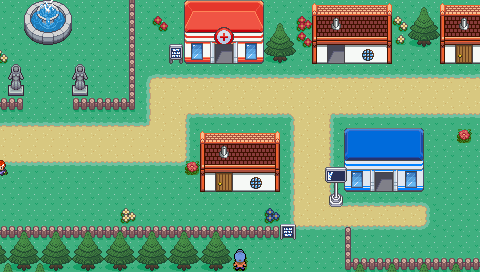
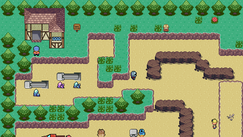

# Pocket Tuxemon

[Tuxemon](https://github.com/Tuxemon/Tuxemon)'s world — its maps, events,
characters and dialogue — imported into
[Pocket RPG Kit](https://github.com/lfkdsk/pocketjs-rpgkit) and played on
[PocketJS](https://github.com/pocket-nexus/pocketjs) (desktop, web, PSP).

Work in progress. The importer reads a pinned Tuxemon checkout
(`bun run fetch:tuxemon`, commit `9e6258ff`) and writes
`rpgkit-project/v1` documents and baked art into this repository.

<p align="center">
  
  
</p>

## Status

- **World (P1, playable):** all 263 Tuxemon maps and their 4,572 events are
  imported automatically — terrain with one-way ledges, animated tiles, tall
  NPC walkers, dialogue, cutscene routes and map transfers. The Spyder
  campaign plays from the bedroom through Paper Town, Cotton Town and City
  Park to the north end of Route 3 (final position `spyder_route3 @4,6`),
  driven by a deterministic autoplay tape, and every imported input lock is
  executed to its unlock.
- **Battles (P2, complete):** the battle database and 578 battle
  textures are imported from Tuxemon's YAML, and `battle/` is a pure
  reducer whose results match Tuxemon's own Python engine on 8,560 recorded
  battles; monsters spawn draw-for-draw like Tuxemon's. The mainline is
  played for real end to end: the autoplay tape fights 100 real battles
  along the way (22 trainer battles + 78 wild), and every trainer battle
  enters Battle Processing and ends `won` with its `battle_outcome` written
  back. The frozen 30-minute 60 Hz tape (109,983 frames / 30 min 33 s)
  replays byte-identical at 60, 30 and 20 Hz, and both failure paths are
  verified — the first loss against Billie, and a later loss on Route 3
  with the faint-point teleport, the heal-before-leaving block and the
  nurse recovery. Double battles, capture, items, swapping and levelling
  are live. The battle scene uses the imported Tuxemon backgrounds,
  islands, trainers, monsters, HUD frames, status/party icons and
  technique strips; every slide, hit, HP/XP tween, faint and capture shake
  is driven by the reducer's rewindable reference tick rather than a wall
  clock.
- **Desktop performance:** maps load one at a time from the pak — the game JS is
  1.1 MB and reaches its first frame in about 150 ms on the desktop QuickJS
  host (measured medians: 151.897 ms at 480×272 and 155.168 ms at 960×544,
  10-run samples); walking stays near 1 ms per frame and map transfers
  under 16 ms.

## Screenshots

The world renders pixel-for-pixel like Tuxemon's own maps. Left: this
runtime; right: an independent render of the same Tuxemon TMX map, used as
the reference in the terrain tests (0 differing pixels).


The first trainer battle, played for real: Billie's Budaye against Nut,
with sprites, HUD and backgrounds imported from Tuxemon and the rules
running bit-exact with Tuxemon's own engine. The lower band is Pocket RPG
Kit's state-driven command/list UI; the screenshot is a nearest-neighbour
2× capture of its 480×272 logical scene.

<p align="center">
  
</p>

The mainline journey, played by the deterministic autoplay tape: Cotton Town
(left) and the north end of Route 3 (right), the northernmost point of the
current journey.

<p align="center">
  
  
</p>

## Play it

- **In a browser:** <https://lfkdsk.github.io/pocketjs-tuxemon/pocket-tuxemon/>
  (deployed from `main` after CI has played the whole journey on it).
- **From a CI run:** every push builds the web version. Open the
  latest [CI run](../../actions/workflows/ci.yml), download the `web-site`
  artifact, unzip it and serve the folder, e.g.
  `python3 -m http.server -d web-site 8000`, then open
  <http://localhost:8000/pocket-tuxemon/>.
- **Locally:** `bun run web`, then serve `dist/web` the same way; or
  `bun run desktop` for the desktop host.
- **Keys:** arrows walk, `A`/`Z`/`Enter` talks and confirms, `B`/`Esc` goes back.

CI also plays the whole maintained journey — bedroom, Paper Town, the first
battle, Route 1 — in headless Chrome against the built site
(`bun tools/verify-web-journey.ts`) and checks every checkpoint's state and
pixels against the goldens.

## Running

```sh
bun run setup           # submodules + dependencies
bun run fetch:tuxemon   # pinned Tuxemon checkout
bun run import          # Tuxemon -> project, maps, art and battle data
bun run desktop         # play on the desktop host
bun run web             # build the web version into dist/web
bun test                # tests (build first for the pixel replays)
```

## PSP build and physical validation

`bun run build:psp` builds a release PRX and EBOOT in `dist/psp`. The
complete **62,206,272-byte asset pack** stays in `assets.pak` beside the
executable. Only fonts, sprite atlases, styles and the external directory
are embedded. A 2 MiB cache retains unbound image textures; textures used
by live nodes stay resident. All 263 maps and 578 battle textures remain
in the package.

```sh
bun run setup
bun run fetch:tuxemon
bun run build:psp

RUN=.pocket-build/validation/psp/local
mkdir -p "$RUN/host0"
cp dist/psp/pocket-tuxemon.prx dist/psp/assets.pak "$RUN/host0/"
usbhostfs_pc -b 10000 "$RUN/host0"
# In another terminal, with PSPLINK running on the PSP:
pspsh -i 127.0.0.1 -p 10000 -e reset
pspsh -i 127.0.0.1 -p 10000 -e 'ldstart host0:/pocket-tuxemon.prx'
```

The build uses the pinned PSP GCC toolchain for QuickJS (`-O3 -fno-gcse`).
The wrapper normalizes GNU object metadata for Rust's LLVM linker.
`POCKETJS_PSP_C_COMPILER=clang bun run build:psp` selects the Clang build.
The hardware journey checks C/Rust double round trips, including signed zero,
subnormals, NaN and infinities, before running the input tape.
`dist/psp/build-receipt.json` records source revisions, changed-file hashes
and artifact SHA-256 values. `patches/` contains the runtime changes
against the existing submodule pins; `bun run patch:vendor` checks the
pins and applies those patches without replacing other local changes.
The session's `immutableState` option requires callers to treat published
snapshots as read-only. Restoring a snapshot constructs a new state.
The extension's `immutableConditions` option requires condition handlers
to leave their argument and extension state trees unchanged;
`deterministicConditions` requires equal arguments to return equal results.
The interpreter reuses completed condition branches with unchanged inputs,
preserving instruction budgets and parallel-event order. Frame-local copy
ownership metadata is deleted after each state fold; character revision caches
retain at most 16 states. Battle turns copy mutable fields and share historical
events. Command handlers retain defensive copies. Dialogue keeps text nodes
mounted and hides empty rows through display styles. Sprite motion and HP
fills use paint transforms. Actor art tracks the page conditions of visible NPCs;
modal-owned input reuses trigger scans while advancing the active fiber.
Battle party icons publish changes per slot, and viewport geometry does not
depend on combat HP. Texture draws at integer scale are split at cache
column boundaries. The GE command buffer occupies complete CPU cache lines
and is flushed and invalidated before its first uncached write.

For repeatable hardware validation, build with `bun run build:psp --journey`,
copy the new PRX to the same `host0` directory and reload it. This feeds the
maintained 3,793-frame opening tape through the game on the PSP, then returns
to live controls. `PocketJS-bench.jsonl` records 300-frame windows of CPU
work, p50/p95/p99 work times and measured presentation intervals.
`profile.jsonl` records checkpoints and the complete terminal state:

```sh
bun tools/verify-psp-journey.ts "$RUN/host0/profile.jsonl"
```

**The 60 fps hardware acceptance target is still unmet.** At 333 MHz on
physical PSP firmware 6.61 through PSPLINK on 2026-10-01, the GCC release
timing build measured:

| 300-frame window | Mean work time | Measured presentation rate |
| --- | ---: | ---: |
| Paper Scoop walking/dialogue (300–599) | 13.47 ms | 54.77 fps |
| Paper Town dialogue/cutscene (1500–1799) | 14.88 ms | 48.51 fps |
| Billie battle (2100–2399) | 11.38 ms | 55.93 fps |
| Billie battle (2400–2699) | 11.82 ms | 55.24 fps |
| Post-battle Town traversal (3300–3599) | 16.18 ms | 46.37 fps |
| Town / Route 1 transition (3600–3899) | 17.37 ms | 43.03 fps |
| Route 1 idle (4200–4499) | 11.60 ms | 59.84 fps |

The retained dialogue rows preserve all 3,793 opening frames' pixels against
the preceding build in the WASM renderer. In the Town window, they reduced
p95 CPU work from 40.72 ms to 30.44 ms; an affected frame's native layout time
fell from 15.58 ms to 3.53 ms. These frames still exceed the 16.7 ms budget.
Per-slot HUD updates reduced the first measured turn from 80.76 ms to
75.84 ms; later turns still take 64–65 ms. The 2100–2399 battle window has
17.22 ms p95 CPU work. Stalls remain beyond the first battle entry, and
these mean rates do not establish smooth battle input.
An earlier build with the metadata lifetime fix held 59.83–60.02 fps over
395 seconds of Route 1 idle, with no explicit QuickJS GC in those windows.
This idle result does not establish walking or battle acceptance.

The physical PSPLINK run reaches Route 1 after the Billie battle, with a terminal state
matching the production replay (SHA-256
`5653f0110656dd4e0a930ff1908c833c9f9fc221c9cfd3a90d22b138ef8d4827`).
The 60 Hz simulation setting does not prove 60 displayed frames per second;
use `1,000,000 / avg_frame_interval_us` from the device log. Map transitions
and first texture loads also cause stalls. Timing logs include periodic
file I/O, so retain the work-time distribution as well as the intervals.
Rebuild without `--journey` or `--bench` and reload the normal release for
human acceptance. Keep raw logs, screenshots and build receipts under
`.pocket-build/validation/`.

Validation commands are `bunx tsc --noEmit`, `bun run build`, `bun test`,
`bun test tests/battle-presentation-sim.test.ts` and
`GB6_IMMUTABLE=1 bun run verify:gb6:full`. The engine suite runs with
`cd vendor/pocket-rpgkit && bun test tests/`. The 109,983-frame, 100-battle
mainline with save/load, rewind and 60/30/20 Hz equivalence was checked on
desktop Bun; the physical acceptance covers the 3,793-frame opening. The
PSP has not passed a 60 fps acceptance run or the full 100-battle mainline.

## License

Tuxemon's code is GPL-3.0-or-later and its art CC BY-SA; this port and
everything it derives from Tuxemon are distributed under the same terms.
Pocket RPG Kit (vendored at `vendor/pocket-rpgkit`) is MIT.

The full GPL-3.0 text is in [`LICENSE`](LICENSE). Tuxemon's per-asset credits
and licenses (for the maps, sprites, tilesets, battle art and dialogue this
repository imports) are copied verbatim from Tuxemon `9e6258ff` into
[`licenses/TUXEMON-ATTRIBUTIONS.md`](licenses/TUXEMON-ATTRIBUTIONS.md), with its
contributor list in
[`licenses/TUXEMON-CONTRIBUTORS.md`](licenses/TUXEMON-CONTRIBUTORS.md).
